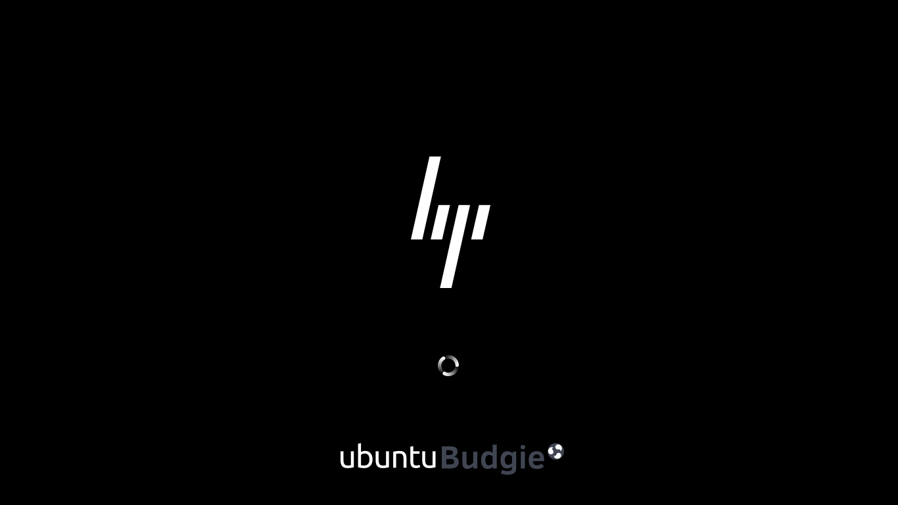

## ubuntu-bgrt-themes

This is based on the work done on BGRT by [@Feichtmeier](https://github.com/Feichtmeier) and contains plymouth-themes for the following flavours:
- [x] kubuntu
- [x] ubuntu
- [x] ubuntu-Budgie
- [x] ubuntu-MATE

_WARNING!: This is still WIP and needs refinement_

## installation:

```bash
# clone this repository
git clone https://github.com/Muqtxdir/ubuntu-bgrt-themes.git
```

```bash
cd ubuntu-bgrt-themes
```

**For ubuntu** 
```bash
# Initialize build system (only required once per repo)
meson build -D ubuntu=true
cd build

# Build and install
sudo ninja install
```

**For kubuntu** 
```bash
# Initialize build system (only required once per repo)
meson build -D kubuntu=true
cd build

# Build and install
sudo ninja install
```

**For ubuntu-MATE** 
```bash
# Initialize build system (only required once per repo)
meson build -D ubuntu-mate=true
cd build

# Build and install
sudo ninja install
```

**For ubuntu-Budgie** 
```bash
# Initialize build system (only required once per repo)
meson build -D ubuntu-budgie=true
cd build

# Build and install
sudo ninja install
```

## screenshots:

- **ubuntu** plymouth-boot-progress:


- **ubuntu-MATE** plymouth-boot-progress:


- **kubuntu** plymouth-boot-progress:


- **ubuntu-Budgie** plymouth-boot-progress:


